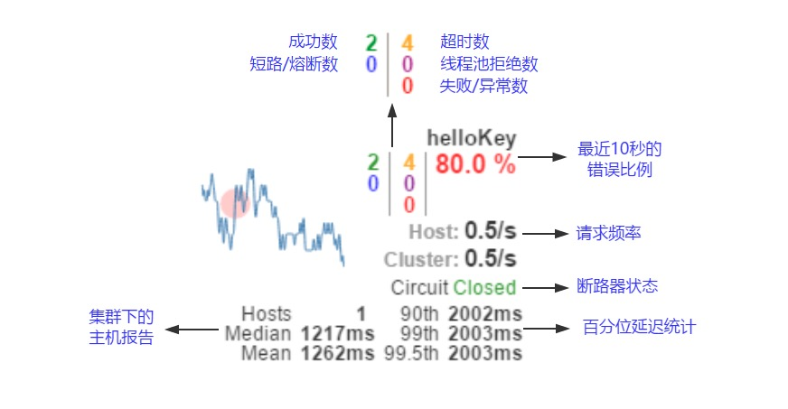

# zzq-spring-cloud-demo
### eureka-server
eureka服务端
### eureka-client
一个微服务模块 通过 @EnableDiscoveryClient 注解注册到eureka。
通过DiscoveryClient可以获取eureka上的微服务模块
### eureka-consumer
一个消费服务模块 调用eureka-client提供的API。
通过LoadBalancerClient 选择指定服务名称获取host 和 port 结合mapping进行远程Rest调用

### eureka-consumer-ribbon
eureka-consumer的升级版 利用ribbon。
结合@LoadBalanced注解直接用RestTemplate通过微服务名称进行远程Rest调用
> 那么这样的请求为什么可以调用成功呢？
因为Spring Cloud Ribbon有一个拦截器，它能够在这里进行实际调用的时候，自动的去选取服务实例，并将实际要请求的IP地址和端口替换这里的服务名，从而完成服务接口的调用

> Spring Cloud Ribbon是基于Netflix Ribbon实现的一套客户端负载均衡的工具。它是一个基于HTTP和TCP的客户端负载均衡器。它可以通过在客户端中配置ribbonServerList来设置服务端列表去轮询访问以达到均衡负载的作用。
  当Ribbon与Eureka联合使用时，ribbonServerList会被DiscoveryEnabledNIWSServerList重写，扩展成从Eureka注册中心中获取服务实例列表。同时它也会用NIWSDiscoveryPing来取代IPing，它将职责委托给Eureka来确定服务端是否已经启动。
  而当Ribbon与Consul联合使用时，ribbonServerList会被ConsulServerList来扩展成从Consul获取服务实例列表。同时由ConsulPing来作为IPing接口的实现。

### eureka-consumer-feign
Spring Cloud feign 通过@EnableFeignClients 开启扫描@FeignClient 结合 Spring MVC mapping、接口绑定web服务API。(扩展了Feign文件上传)


### config-repo
配置文件

### config-server 
一个分布式配置中心 @EnableConfigServer开启

### config-server-eureka
一个分布式配置中心 注册到eureka 

### config-client
一个用来从 分布式配置中心 获取配置的demo 因为分布式配置中心 注册到注册中心 所以可以通过注册中心获取配置
只需配置注册中心地址  指定的服务名称
可以通过RefreshScope热更新配置 （通过spring-boot-starter-actuator模块的/refresh）
```properties
#注册中心
eureka.client.serviceUrl.defaultZone=http://127.0.0.1:10001/eureka/
#开启通过服务来访问Config Server
spring.cloud.config.discovery.enabled=true
#指定访问的服务
spring.cloud.config.discovery.serviceId=config-server-eureka
#环境配置
spring.cloud.config.profile=dev
#关闭鉴权RefreshScope
management.security.enabled=false
```
### eureka-consumer-ribbon-hystrix
利用hystrix 实现服务降级、隔离、断路 @EnableCircuitBreaker开启
>那么断路器是在什么情况下开始起作用呢？这里涉及到断路器的三个重要参数：快照时间窗、请求总数下限、错误百分比下限。这个参数的作用分别是：
 快照时间窗：断路器确定是否打开需要统计一些请求和错误数据，而统计的时间范围就是快照时间窗，默认为最近的10秒。
 请求总数下限：在快照时间窗内，必须满足请求总数下限才有资格根据熔断。默认为20，意味着在10秒内，如果该hystrix命令的调用此时不足20次，即时所有的请求都超时或其他原因失败，断路器都不会打开。
 错误百分比下限：当请求总数在快照时间窗内超过了下限，比如发生了30次调用，如果在这30次调用中，有16次发生了超时异常，也就是超过50%的错误百分比，在默认设定50%下限情况下，这时候就会将断路器打开。
 那么当断路器打开之后会发生什么呢？我们先来说说断路器未打开之前，对于之前那个示例的情况就是每个请求都会在当hystrix超时之后返回fallback，每个请求时间延迟就是近似hystrix的超时时间，如果设置为5秒，那么每个请求就都要延迟5秒才会返回。当熔断器在10秒内发现请求总数超过20，并且错误百分比超过50%，这个时候熔断器打开。打开之后，再有请求调用的时候，将不会调用主逻辑，而是直接调用降级逻辑，这个时候就不会等待5秒之后才返回fallback。通过断路器，实现了自动地发现错误并将降级逻辑切换为主逻辑，减少响应延迟的效果。
 在断路器打开之后，处理逻辑并没有结束，我们的降级逻辑已经被成了主逻辑，那么原来的主逻辑要如何恢复呢？对于这一问题，hystrix也为我们实现了自动恢复功能。当断路器打开，对主逻辑进行熔断之后，hystrix会启动一个休眠时间窗，在这个时间窗内，降级逻辑是临时的成为主逻辑，当休眠时间窗到期，断路器将进入半开状态，释放一次请求到原来的主逻辑上，如果此次请求正常返回，那么断路器将继续闭合，主逻辑恢复，如果这次请求依然有问题，断路器继续进入打开状态，休眠时间窗重新计时



